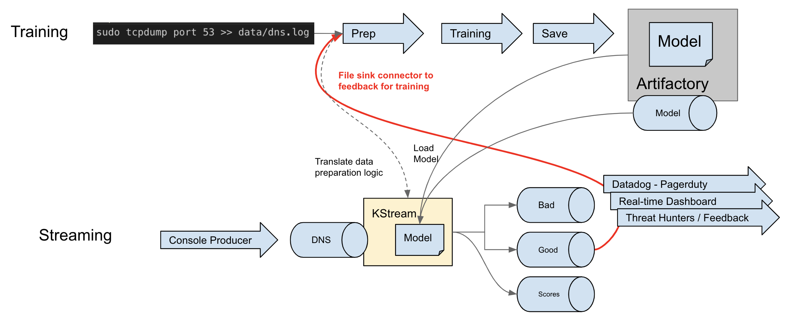

# Introduction
This is an example of how to deploy a machine learning model to a KStreams application. The ML library used here is Mallet:

```
libraryDependencies += "cc.mallet" % "mallet" % "2.0.8",
```

[Mallet](http://mallet.cs.umass.edu/) is a Java based ML library that contains an implementation of a
Latent Dirichlet allocation (LDA) algorithm.
LDA is a topic modeling unsupervised learning algorithm. It takes a corpus of text and classifies them under topics.


## Get Data !!!!!!
In order to run this demo, you'll need some data. The make command below starts a tcpdump process listening to port 53 and capturing dns logs. It then writes the logs into data/dns.log. You will need a significat amount of data for training so let this run all day ( or a couple of days ) while you surf the net.
```bash
$ make tcpdump
```

### Running the Demo

Build the scala KStream code and build docker compose

```bash
make build
make cluster
make connect
```

## KSQL

Transform the AVRO message to CSV for easy training

``` sql
CREATE STREAM claims WITH (KAFKA_TOPIC='claims',VALUE_FORMAT='AVRO');
CREATE STREAM claims_json WITH (KAFKA_TOPIC='claims_json',VALUE_FORMAT='JSON') AS SELECT * FROM claims;
```

```sql
CREATE STREAM claim_scores (
 value VARCHAR,
 key VARCHAR,
 score Double,
 modelName VARCHAR,
 org VARCHAR
)
WITH (
  KAFKA_TOPIC='claims-scores', 
  VALUE_FORMAT='JSON', KEY='key'
);

SELECT rowkey, count(score), min(score), max(score)
  FROM claim_scores
  GROUP BY rowkey;

```

# Analyzing output
If the scores start to converge closer to the threshold, consider increasing the number of LDA topics when training ( or __K__ ). In this ML workflow, changing __K__ is a manual adjustment requiring restarting the training service but could be made to be dynamic.

# Machine Learning Workflow
